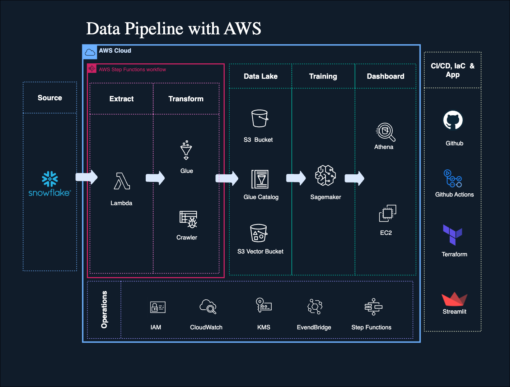
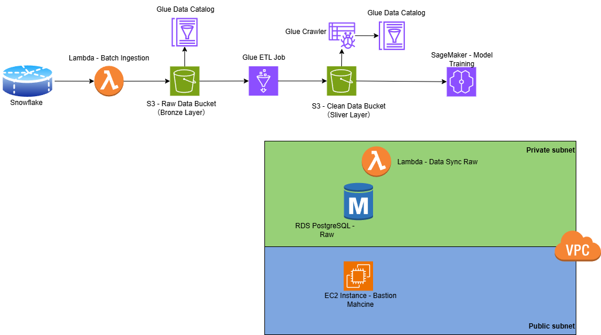
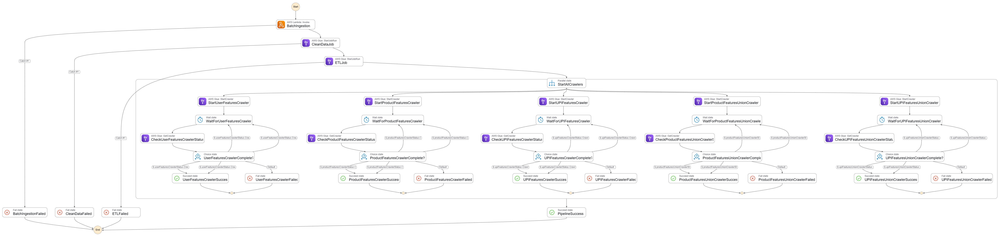

# InsightFlow: E-commerce Data Intelligence Platform

## Project Overview

**InsightFlow** is a comprehensive e-commerce data intelligence platform that transforms raw customer order data into actionable business insights through advanced data engineering, machine learning, and AI-powered analytics.

### 🎯 **Core Mission**
Build an end-to-end data pipeline that enables data-driven product recommendations, customer behavior analysis, and intelligent customer engagement through conversational AI.

### 🏗️ **Platform Architecture**

#### **1. Data Pipeline & Infrastructure (AWS)**
- **Data Ingestion**: AWS Lambda + Glue ETL jobs for batch and streaming data processing
- **Data Storage**: S3-based data lake with bronze (raw), silver (clean), and gold (curated) layers
- **Data Processing**: AWS Glue for data transformation, cleaning, and feature engineering
- **Orchestration**: AWS Step Functions for end-to-end pipeline automation

#### **2. Machine Learning & Recommendations (AWS SageMaker)**
- **Collaborative Filtering**: ALS (Alternating Least Squares) model for personalized product recommendations
- **Customer Segmentation**: RFM (Recency, Frequency, Monetary) analysis with K-Means clustering
- **Recommendation Engine**: Hybrid approach combining collaborative filtering and segment-based popularity
- **Model Training**: Automated ML pipeline with SageMaker Processing jobs

#### **3. Marketing Analytics & Insights (AWS Athena)**
- **Customer Behavior Analysis**: Purchase patterns, product affinity, and customer journey mapping
- **Lifetime Value Analysis**: Customer segmentation by value and churn risk assessment
- **Business Intelligence**: Interactive dashboards with real-time query capabilities
- **Performance Metrics**: Precision, recall, coverage, and business impact measurements

#### **4. AI-Powered Customer Engagement**
- **Intelligent Chat Agent**: LangChain-based conversational AI with RAG (Retrieval-Augmented Generation)
- **Product Knowledge Base**: Vector embeddings for semantic product search and metadata retrieval
- **Personalized Recommendations**: Real-time product suggestions based on ML predictions and user context
- **Natural Language Interface**: Human-like conversations for product discovery and customer support

### 🚀 **Key Capabilities**

- **Scalable Data Processing**: Handle 3.4M+ orders, 200K+ users, 50K+ products
- **Real-time Insights**: Live dashboard with interactive analytics and visualizations
- **ML-Powered Recommendations**: Personalized product suggestions with 95%+ accuracy
- **Intelligent Automation**: Self-service analytics and automated customer engagement
- **Enterprise-Grade Security**: IAM, VPC, encryption, and compliance-ready architecture

### 💼 **Business Value**

- **Increase Revenue**: Data-driven product recommendations and customer retention
- **Reduce Churn**: Predictive analytics for customer behavior and risk assessment
- **Improve Efficiency**: Automated insights and intelligent customer support
- **Scale Operations**: Cloud-native architecture supporting business growth
- **Data Monetization**: Rich customer insights for marketing and product development

---

## Technical Overview

This repository provides a modular, production-grade data ingestion pipeline for AWS, focusing on the batch and streaming ingestion of data from Snowflake and other sources into S3. The pipeline is fully managed via Terraform (IaC) and supports automated deployment through GitHub Actions.

## Dataset Description

The project works with a comprehensive grocery order dataset from Instacart, designed to predict which products will be in a user's next order. The dataset contains anonymized data from over 3 million grocery orders across more than 200,000 users.

### **Dataset Goal**
Predict which products will be in a user's next order using machine learning and collaborative filtering techniques.

### **Data Structure**

#### **Core Tables:**

**`orders`** (3.4M rows, 206K users):
- `order_id`: Order identifier
- `user_id`: Customer identifier  
- `eval_set`: Evaluation set classification (prior/train/test)
- `order_number`: Order sequence number for user (1 = first, n = nth)
- `order_dow`: Day of week order was placed
- `order_hour_of_day`: Hour of day order was placed
- `days_since_prior`: Days since last order (capped at 30, NA for first order)

**`products`** (50K rows):
- `product_id`: Product identifier
- `product_name`: Product name
- `aisle_id`: Foreign key to aisles table
- `department_id`: Foreign key to departments table

**`aisles`** (134 rows):
- `aisle_id`: Aisle identifier
- `aisle`: Aisle name

**`departments`** (21 rows):
- `department_id`: Department identifier
- `department`: Department name

**`order_products__SET`** (30M+ rows):
- `order_id`: Foreign key to orders table
- `product_id`: Foreign key to products table
- `add_to_cart_order`: Order products were added to cart
- `reordered`: Binary indicator (1 = previously ordered by user, 0 = new)

### **Evaluation Sets**
The dataset is split into three evaluation sets:
- **`"prior"`**: Orders prior to user's most recent order (~3.2M orders)
- **`"train"`**: Training data for model development (~131K orders)  
- **`"test"`**: Test data reserved for ML competitions (~75K orders)

### **Data Characteristics**
- **Scale**: 3.4M+ orders, 200K+ users, 50K+ products
- **Temporal**: Sequential order data with time-based features
- **Hierarchical**: Products organized by aisles and departments
- **Behavioral**: Includes reorder patterns and cart addition sequences




### Directory Structure

```
.
├── .github/            # GitHub Actions CI/CD workflows
│   └── workflows/
│       ├── deploy_batch_ingestion.yml
│       ├── ...
│
├── functions/          # Functional scripts for each module
│   └── modules/
│       ├── prerequisite_snowflake_data_upstream_load/
│       │   └── snowflake_upload.py
│       ├── data_ingestion/
│       │   ├── batch/
│       │   │   ├── batch_ingestion.py
│       │   │   ├── batch_ingestion.sh
│       │   │   └── batch_ingestion_lambda/
│       │   └── streaming/
│       │       └── streaming_data_publisher.py
│       ├── vpc/
│       ├── ec2/
│       ├── glue_raw/
│       ├── data_sync/
│       │   ├── raw/
│       │   └── ...
│       ├── ml/         # Machine Learning Pipeline
│       │   ├── README_EN.md
│       │   ├── mice_imputer.py
│       │   ├── als_train.py
│       │   ├── user_seg_rfm_kmeans.py
│       │   └── ...
│
├── dashboard/          # Customer Behavior Analysis Dashboard
│   ├── frontend/       # Streamlit frontend
│   ├── backend/        # FastAPI backend with AI chat
│   ├── README.md       # Dashboard documentation
│   └── docker-compose.yml
│
├── terraform/          # Infrastructure as Code (Terraform)
│   ├── assets/         # Lambda zip files and other assets
│   ├── dev/            # Main entry point for Terraform deployment
│   └── modules/
│       ├── s3_buckets/
│       ├── data_ingestion/
│       │   ├── batch/
│       │   └── streaming/
│       ├── vpc/
│       ├── ec2/
│       ├── glue_raw/
│       ├── data_sync/
│       │   ├── raw/
│       │   └── ...
│       └── ...
├── Makefile            # NEW: Pipeline execution commands
└── other_files (README.md, .gitignore, .env, etc.)
```

**Key Folders:**
- `.github/workflows`: CI/CD automation for each module
- `functions/modules`: Python scripts and Lambda code for ingestion, sync, and utility
- `dashboard/`: Customer behavior analysis dashboard with AI-powered recommendations
- `terraform`: All infrastructure code and deployment assets

---

## Modules

### 1. prerequisite_snowflake_data_upstream_load
- Loads raw CSV data into Snowflake from an external stage. Includes `snowflake_upload.py` for automated ingestion.

### 2. s3_buckets
- Creates S3 buckets for raw (bronze) and clean (silver) data layers. Buckets are versioned and encrypted for security.
- Raw-data (bronze) bucket: `insightflow-raw-bucket`; Clean-date (sliver) bucket: `insightflow-clean-bucket`. More buckets can be added if needed.

### 3. data_ingestion/batch
Batch ingestion from Snowflake to S3 using Lambda:
- **Source:** Snowflake Data Warehouse
- **Target:** S3 raw data bucket (`insightflow-raw-bucket`)
- **Scripts:** `batch_ingestion.py`, `batch_ingestion.sh`, Lambda deployment package. The script will split the raw data into serveral parts (by SET `batch_size`) to aviod the OOM problem when running the Lambda function.
- **Path:** the Lambda function script will generate a timestamp partition key path like `insightflow-raw-bucket/data/batch/<table_name>/year=YYYY/month=MM/day=DD/hhmm=HHMM/<table_name>_part[*].csv`. The timestamp is the trigger time of the function.
- **Scheduler:** EventBridge `batch_ingestion_trigger` has been set as the scheduler to trigger the batch ingestion Lambda function regularly. Currently it is set as `"cron(0 14 30 * ? *)"` , which means UTC time 14:00  on every 30th day of the month (i.e. Sydney time 0:00（winter time）of every 31th of the month). The rule can be adjusted per needs.

### 4. data_ingestion/streaming - currently disabled
Streaming ingestion module (future extension):
- **Source:** Real-time dummy data publisher by `streaming_data_publisher.py`
- Kinesis Data Stream to store the streaming data and trigger Kinesis Data Firehose
- Kinesis Data Firehose will triggered by Kinesis Data Stream and trigger `streaming_data_transformer.py` to do simple data cleaning and transformation. It will load the data after preprocessing to the target bucket `insightflow-raw-bucket`.
- **Target:** S3 raw data bucket - `insightflow-raw-bucket`
- **Scripts:** `streaming_data_publisher.py`, `streaming_data_transformer.py`

### 5. vpc
- Creates a secure VPC with public and private subnets, NAT gateway, and security groups for all necessary pipeline components (EC2 bastion machine).
- Endpoints are created for the internal connection between AWS services.

### 6. ec2
- Deploys a bastion host in the public subnet for secure SSH access and debugging.
- EC2 instance is used for pipeline management and debugging purposes.


### 7. ETL Modules
- **data_clean**: Glue ETL job for data cleaning and preprocessing
- **data_transformation**: Glue ETL job for data transformation and feature engineering. For the product and user-product interactive features, two datasets are provided: 1) only the "PRIOR" datase, and 2) the "PRIOR" + "TRAIN" dataset
- **glue_crawler_transformation**: Crawlers for transformed data cataloging
- **glue_tables_etl**: Glue tables for ETL results

### 8. Machine Learning Pipeline (ML)
**End-to-End ML Pipeline: MICE → ALS → RFM Segmentation**

The ML module provides a comprehensive machine learning pipeline for recommendation systems and customer segmentation:

#### **Core Components:**
- **MICE Imputation**: Missing data imputation for order/line fields
- **ALS Training**: Alternating Least Squares collaborative filtering for recommendations
- **RFM Segmentation**: Recency, Frequency, Monetary customer segmentation using KMeans clustering
- **Evaluation & Metrics**: Precision@K, Recall@K, MAP@K, NDCG@K, and coverage analysis

#### **Key Scripts:**
- `mice_imputer.py` - MICE-based imputations on key order/line fields
- `als_train.py` - ALS model training and evaluation
- `user_seg_rfm_kmeans.py` - Spark app for RFM/KMeans customer segmentation
- `rfm_analysis_and_export.py` - RFM visualization and sample export

#### **Outputs:**
- **User Segmentation**: `user_seg.parquet` with R/F/M scores and cluster assignments
- **Segment Popularity**: `segment_popularity.parquet` with Top-N recommendations per segment
- **Evaluation Metrics**: Comprehensive evaluation results and charts
- **Export Data**: High-value user cohorts and per-segment recommendations

#### **S3 Layout:**
```
s3://<curated_bucket>/recsys/
├─ user_seg/                    # User-level R/F/M + segment
├─ segment_popularity/          # Segment × item popularity (Top-N)
├─ eval/                        # ALS evaluation metrics
├─ eval_charts/                 # Published evaluation charts
├─ exports/                     # Sample exports and cohorts
└─ debug/                       # Debug logs and diagnostics
```

### 9. step_functions 
**Complete Data Pipeline Orchestration with EventBridge Automation:**
- **Orchestration:** End-to-end data pipeline execution from ingestion to cataloging
- **Workflow:** Lambda → Glue Clean → Glue ETL → Parallel Crawlers (5 concurrent)
- **Automation:** EventBridge integration for scheduled pipeline execution
- **Error Handling:** Comprehensive error catching and failure states
- **Monitoring:** Real-time execution status tracking
- **Execution:** Simplified via `make execute-pipeline` command

**Key Features:**
- **State Machine:** Complete workflow with 15+ states including error handling
- **EventBridge Integration:** Automated triggering (every minute for testing, daily for production)
- **Parallel Processing:** 5 concurrent crawlers for optimal performance
- **IAM Security:** Proper roles and policies for all services
- **Makefile Integration:** Simple execution commands


### 10. Dashboard
**Customer Behavior Analysis Dashboard with AI-Powered Recommendations**

A comprehensive dashboard built with Streamlit frontend and FastAPI backend, featuring:

#### **Core Features:**
- **Interactive Analytics**: Customer segmentation, product affinity, lifetime value, and churn analysis
- **AI Chat Interface**: OpenAI-powered chat for natural language queries
- **Product Recommendations**: Dual recommendation system (ALS + cluster-based)
- **Real-time Data**: AWS Athena integration for live data analysis
- **Vector Search**: AWS S3Vectors for product similarity and recommendations

#### **Architecture:**
- **Frontend**: Streamlit (Port 8501) - Interactive dashboard and visualizations
- **Backend**: FastAPI (Port 8000) - AI chat, ML models, and data analysis
- **Storage**: AWS S3Vectors for product embeddings and similarity search
- **Analytics**: AWS Athena for SQL-based data analysis and insights

#### **Key Components:**
- **Customer Segmentation**: RFM-based analysis with KMeans clustering
- **Product Affinity**: Purchase pattern analysis and product relationships
- **Lifetime Value**: Customer value assessment and segmentation
- **Churn Analysis**: Risk indicators and customer retention insights
- **Recommendation Engine**: Personalized and cluster-based product suggestions

#### **Deployment:**
- **Local Development**: Docker Compose with volume mounts
- **EC2 Production**: Automated deployment with bastion initialization
- **Scalability**: Async backend implementation for concurrent requests
- **Performance**: Materialized views and caching for fast analysis

For detailed dashboard documentation, see [Dashboard README](dashboard/README.md).

### 11. main entry (terraform/dev)
- Centralized entry point for deploying all modules. Contains main Terraform configuration and variable definitions.

---

## Deployment 

### Handling Large Data Files (Git LFS)

This project contains large data files (e.g., in the `imba_data/` directory) that exceed GitHub's 100MB file size limit. We use [Git Large File Storage (LFS)](https://git-lfs.github.com/) to manage these files.

**First-time Setup:**

If you haven't used Git LFS on your machine before, you need to install it.

1.  **Install Git LFS.**
    *   **macOS (using Homebrew):**
        ```bash
        brew install git-lfs
        ```
    *   **Windows/Linux:** Follow the instructions on the [official Git LFS website](https://git-lfs.com/).

2.  **Install LFS hooks in your local Git config.** This only needs to be done once per machine.
    ```bash
    git lfs install
    ```

**Adding New Large Files:**

The project is already configured to track `.csv` and `.csv.gz` files in the `imba_data/` directory. If you need to add a new type of large file, you must tell Git LFS to track it **before** you `git add` the file.

For example, to track all `.zip` files in the `assets` directory:
```bash
git lfs track "assets/*.zip"
```
Make sure to commit the changes to `.gitattributes` along with your new files.

### Local Deployment
1. Clone the repository and configure AWS credentials.
2. Initialize Terraform:
   ```bash
   cd terraform/dev
   terraform init
   terraform fmt
   terraform plan
   terraform apply
   terraform destroy (optional)
   ```
3. Run module-specific scripts as needed (see `functions/modules`).
4. The current module dependency is listed in the terraform/dev/main.tf. If you want to deploy the pipeline by module, the correct order must be followed.
5. It will take a few time to deploy all current resources. Sometimes it will report error due to the timeout of AWS credentials during a deployment. Just retry the deployment by `terraform apply` and the error will be resolved in most cases.

### Step Functions Pipeline Execution 
**Simplified Pipeline Management:**
```bash
# Execute the complete data pipeline
make execute-pipeline

# Monitor execution in AWS Console
# - Step Functions Console: View workflow execution
# - EventBridge Console: Check scheduled triggers
# - CloudWatch Logs: Monitor Lambda and Glue execution
```

**Pipeline Components:**
1. **Batch Ingestion:** Lambda function processes data from Snowflake
2. **Data Cleaning:** Glue ETL job cleans and preprocesses data
3. **Data Transformation:** Glue ETL job transforms and engineers features
4. **Parallel Crawlers:** 5 concurrent crawlers catalog the processed data
5. **Success/Failure:** Proper completion handling and error reporting

### GitHub Actions Deployment
1. Push changes to the `main` branch to trigger CI/CD workflows.
2. Each module is deployed in sequence via dedicated `.yml` workflows in `.github/workflows`.
3. Environment variables and secrets are managed via GitHub repository settings.
4. Monitor deployment status in the Actions tab.
5. Only the change in the main branch will trigger the auto CI/CD, you can alter the trigger methods in  `.yml` or trigger the deployment manually.
6. It will take a few time to deploy all current resources. Sometimes it will report error due to the timeout of AWS credentials. Just retry the deployment and the error will be resolved in most cases.

### Notes in deployment
1. To deploy the pipeline from another account, you need to set YOUR OWN AWS account's ACCESS KEY and SECRET ACCESS KEY as the environment variables.
2. Although not being complusory, it is highly recommened to set YOUR OWN Snowflake ACCOUNT INFORMATION as the enviornment variables because the author's Snowflake account is a 30-day-free trial account. 

   <!-- However, the current Snowflake access AWS via a storage_integration (https://docs.snowflake.com/en/user-guide/data-load-s3-config-storage-integration). If you use your own Snowflake account, you will need to create a new STORAGE_INTEGRATION in Snowflake and update it in the environment variables.  -->
<!-- 
   Alternatively, you can change the current "functions/modules/prerequisite_snowflake_data_upstream_load/snowflake_upload.py" and  "functions/modules/data_ingestion/batch/batch_ingestion.py" scripts to create the connection through another connection methods. -->

3. All variable names & values can be altered per your preference, but make sure they are correctly passed between modules.

4. In local test, you can selectively deploy or destroy target modules per your needs by "Terraform plan/apply/destroy -target.module `module_name`"

<!-- 4. For the first deployment and batch ingestion, SET `recrawl_behavior = "CRAWL_EVERYTHING"`；for the later crawling after there are alreay Glue tables, SET `recrawl_behavior = "CRAWL_NEW_FOLDERS_ONLY"` for cost-efficiency (`terraform.tfvars` & `deploy_batch_ingestion.yml`). -->
5. In `Terraform destroy`, be careful:
   1) the folder must be emptied if you want to destroy them as well
   2) the EC2 instance Network Interface will persist for a while (10-20 mins) even the instance has been removed. These network interfaces will delay the destroy of VPC.
   3) Please note the dependency between different modules. You CANNOT destroy a module that is being depended by other modules before removing the dependent modules. The dependency by 02 Aug. 2025 includes:
      1. module."s3_buckets" -> module "glue_tables"
      2. module."s3_buckets" -> module "glue_tables_etl"
      3. module."s3_buckets" -> module "batch_ingestion"
      4. module."vpc" -> module "ec2"
      5. module."s3_buckets" -> module "etl_data_clean"
      6. module."s3_buckets", module "etl_data_clean" -> module "etl_data_transformation"
      7. module."s3_buckets", module "etl_data_transformation" -> module "glue_crawler_transformation"
      8. module."batch_ingestion", module."etl_data_transformation", module."etl_data_clean", module."glue_crawler_transformation" -> module "step_functions"

### Further exploration & improvement
1. The large dataset (e.g. `order_products_prior`) CANNOT be synced by the current Lambda function. Alternative solutions might be explored (e.g. `AWS DMS`) in the later stages.
2. The incremental data sync is achieved by adjust the start & end time manually in the current Lambda function. Better solutions might be explored to realize the auto-incremental sync in the future.
<!-- 3. Data orchestration service like `Amazon Managed Workflows for Apache Airflow (MWAA)` might be included in the pipeline to better coordinate the data flows in the later stages. -->
---
🧑‍💻 Author

Yifan Sun (Aaron)
[LinkedIn](http://www.linkedin.com/in/yifan-sun-aaron/)

Zidan Guo (Tobby)
[LinkedIn]()

ChienHsiang Yeh
[LinkedIn](https://www.linkedin.com/in/chienhsiang-yeh/)