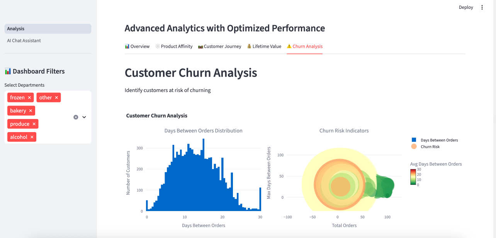
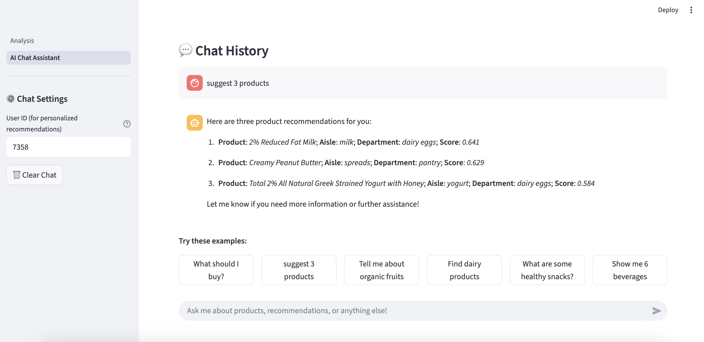

# Summary
A dashboard with a comprehensive Customer Behavior Analysis Dashboard with AI-powered product recommendations, built using Streamlit frontend, FastAPI backend, and AWS S3Vectors for vector storage.




# Docker Setup Guide

## Quick Start

1. **Set up data files (IMPORTANT):**
   ```bash
   # Install Git LFS if not already installed
   brew install git-lfs  # macOS
   # or: sudo apt-get install git-lfs  # Ubuntu/Debian
   
   # Initialize Git LFS and download data files
   git lfs install
   git lfs pull
   
   # Verify data files are downloaded (should show files > 100MB)
   ls -la ../imba_data/
   ```

2. **Create environment file:**
   ```bash
   cp backend/env_template.txt .env
   # Edit .env and add your OPENAI_API_KEY and AWS credentials
   ```

3. **Start all services:**
   ```bash
   docker-compose up -d
   ```

4. **Access the applications:**
   - Frontend: http://localhost:8501
   - Backend API: http://localhost:8000
   - AWS S3 Vector Bucket: Managed via AWS Console

## Services

### Frontend (Streamlit)
- **Port:** 8501
- **URL:** http://localhost:8501
- **Features:** Dashboard with analytics and chat interface
- **Documentation:** [Frontend README](frontend/README.md)

### Backend (FastAPI)
- **Port:** 8000
- **URL:** http://localhost:8000
- **Features:** AI chat, ML models, vector search with S3Vectors
- **Documentation:** [Backend README](backend/README.md)

### AWS S3 Vector Bucket
- **Service:** AWS S3Vectors (managed service)
- **Features:** Product embeddings storage and similarity search
- **Configuration:** Set via environment variables
- **Benefits:** Scalable, managed, cost-effective vector storage

## Commands

```bash
# Start all services
docker-compose up -d

# View logs
docker-compose logs -f

# Stop all services
docker-compose down

# Rebuild and start
docker-compose up --build -d

# Access specific service
docker-compose exec backend python
docker-compose exec frontend streamlit run frontend/main.py
```

## Development

For development, you can mount volumes to see changes immediately:

```bash
# Start with volume mounts for development
docker-compose -f docker-compose.yml -f docker-compose.dev.yml up -d
```

## Data Setup

### Git LFS Files
The data files in `imba_data/` are stored using Git LFS (Large File Storage). You must download the actual data files before running the dashboard.

### Download Data Files
```bash
# Install Git LFS
brew install git-lfs  # macOS
# or: sudo apt-get install git-lfs  # Ubuntu/Debian

# Initialize and download
git lfs install
git lfs pull

# Verify download (files should be > 100MB)
ls -la ../imba_data/
```

### Expected File Structure
After downloading, `imba_data/` should contain:
```
imba_data/
├── orders.csv                    # ~100MB
├── products.csv                  # ~1MB
├── departments.csv               # ~1KB
├── aisles.csv                    # ~10KB
├── order_products__prior.csv.gz  # ~150MB (compressed)
└── order_products__train.csv.gz  # ~7MB (compressed)
```

### Data Filtering for Testing
For efficient testing, the data loaders automatically filter the data:
- **User ID restriction**: Only users with `user_id < 10000` are loaded
- **Product restriction**: Only products with `product_id < 1000` are used for vector store
- This significantly reduces memory usage and processing time

### Memory Configuration
The docker-compose.yml specifies memory limits for each service:
- **Backend**: 4GB limit, 2GB reservation
- **Frontend**: 4GB limit, 2GB reservation

**For lower memory systems**, you can reduce these limits:
```yaml
# In docker-compose.yml, modify the deploy section:
deploy:
  resources:
    limits:
      memory: 2G  # Reduce from 4G
    reservations:
      memory: 1G  # Reduce from 2G
```

## AWS S3 Vector Bucket Configuration

### Environment Variables
The system uses AWS S3Vectors for vector storage. Configure these in your `.env` file:

```bash
# AWS Configuration
AWS_ACCESS_KEY_ID=your_aws_access_key
AWS_SECRET_ACCESS_KEY=your_aws_secret_key
AWS_DEFAULT_REGION=ap-southeast-2

# S3 Vector Bucket Configuration
S3_VECTORS_BUCKET=imba-vector-database
S3_VECTORS_INDEX=products-index

# OpenAI Configuration
OPENAI_API_KEY=your_openai_api_key
```

### Benefits of S3Vectors
- ✅ **Managed Service**: No infrastructure management required
- ✅ **Scalable**: Handles large vector datasets efficiently
- ✅ **Cost-effective**: Pay only for what you use
- ✅ **High Performance**: Optimized for vector similarity search
- ✅ **Metadata Support**: Rich metadata for product information

## Troubleshooting

### Data Issues
1. **"Not a gzipped file" error**: Data files are still Git LFS pointers
   ```bash
   git lfs pull  # Download actual files
   ```

2. **"File not found" error**: Check data files exist
   ```bash
   ls -la ../imba_data/
   ```

3. **Memory issues**: Ensure Docker has sufficient memory (4GB+ recommended)

### Service Issues
1. **Check service health:**
   ```bash
   docker-compose ps
   ```

2. **View logs:**
   ```bash
   docker-compose logs backend
   docker-compose logs frontend
   ```

3. **Restart specific service:**
   ```bash
   docker-compose restart backend
   ```

4. **Rebuild containers:**
   ```bash
   docker-compose down
   docker-compose up --build -d
   ```

### AWS S3Vectors Issues
1. **Authentication errors**: Check AWS credentials in `.env`
2. **Bucket not found**: Verify S3_VECTORS_BUCKET exists in AWS
3. **Network connectivity**: Ensure backend can reach AWS services

## Documentation

For detailed information about each component:

- **[Backend Documentation](backend/README.md)** - FastAPI backend with AI chat, ML models, and S3Vectors search
- **[Frontend Documentation](frontend/README.md)** - Streamlit dashboard with analytics and chat interface
- **[Frontend Structure Guide](frontend/README_STRUCTURE.md)** - Detailed breakdown of frontend components and architecture